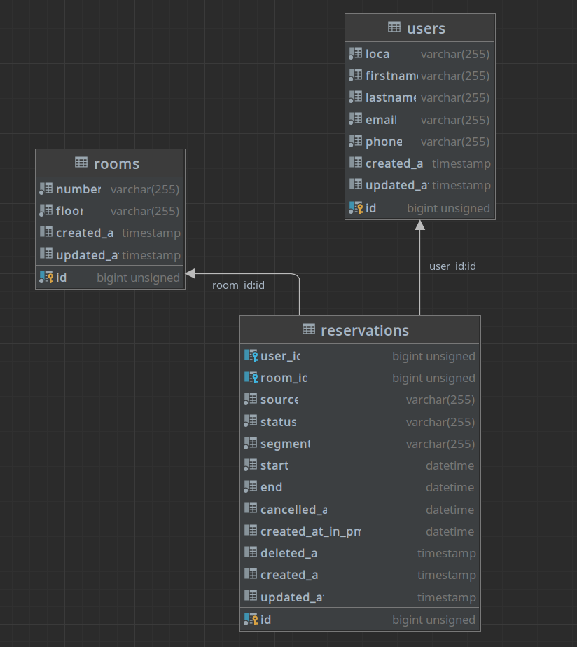

# Bookboost Laravel PMS - Test

## Usage

### Development

Start the application locally with docker-compose:

```bash
make up
```

Migration and seeding the database:

```bash
make migrate
```

### Testing

```bash
make test
```

## Overview


